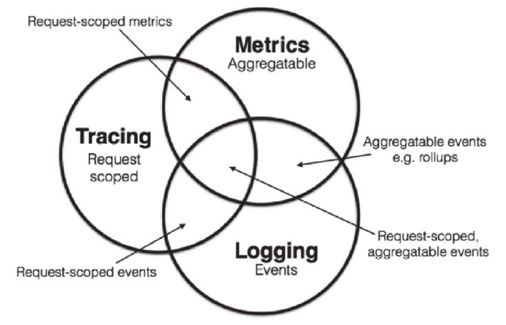

# 可观测性

可观测性分为三个维度：事件日志、链路追踪、聚合度量

## 日志 Logging

作用： 记录离散事件

## 追踪 Tracing

单体项目：追踪有 IDE 断点调试，栈错误输出等
微服务时代：服务间的网络传输信息和服务内部的调用堆栈信息
作用：排查故障

## 度量 Metrics

度量：对系统中某一类数据的统计聚合
作用：监控（Monitoring）和预警（Alert）

Java 天生自带 JMX 的基本度量，包括内存大小、各分代和用量、峰值的线程数、垃圾收集的吞吐量、频率等。
