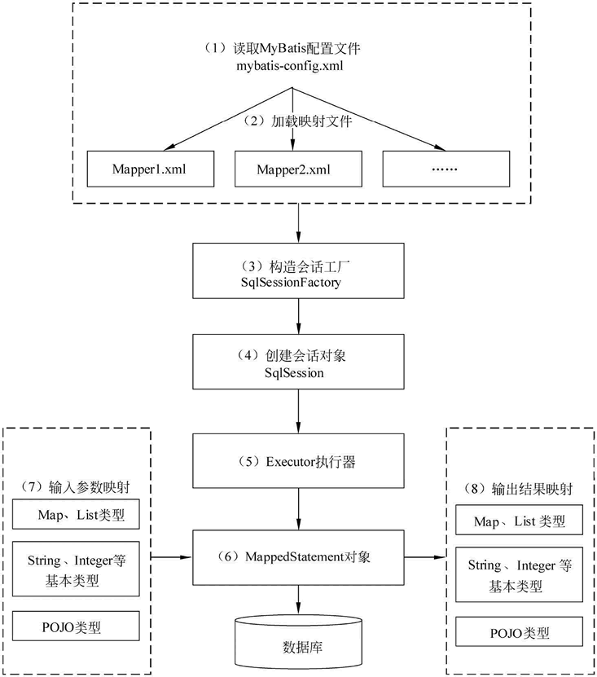

# MyBatis

## MyBatis 的作用

- MyBatis 免除了几乎所有的 JDBC 代码以及设置参数和获取结果集的工作
- MyBatis 可以通过简单的 XML 或注解来配置和映射原始类型、接口和 Java POJO（Plain Old Java Objects，普通老式 Java 对象）为数据库中的记录

## MyBatis 的 工作原理及核心流程

四个核心对象：

- SqlSession：对象中包含了执行 SQL 语句的所有方法。
- Executor 接口：根据 SqlSession 传递的参数动态生成需要执行的 SQL 语句。也负责缓存维护
- MappedStatement 对象：封闭映射 SQL
- ResultHandler 对象：处理返回结果

上图中，2和3步骤应该是并行的

## MyBatis中核心对象的作用域与生命周期

| 对象 | 作用域及使用说明 |
| --- | --- |
| SqlSessionFactoryBuilder | 方法作用域，用来解析 xml 文件并实例化 SqlSessionFactory 的 |
| SqlSessionFactory | 应用生命周期作用域，全局单例，线程安全 |
| SqlSession | 请求或方法作用域，非线程安全，用完需关闭，一个线程使用单独的 SqlSession，一个请求使用一个，响应时需要关闭 |
| Mapper | 方法作用域，理论是和 SqlSession 的作用域一样大 |

## MyBatis 的源码

## MyBatis 的面试题ß

## 参考资料

- [MyBatis 官方网站](https://mybatis.net.cn/)
- 马士兵 MyBatis 源码课程

