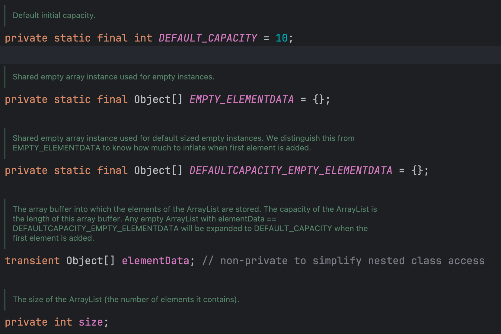

# 集合

## ArrayList的1.8实现

### 内部的数据结构



- transient 关键字：它的作用是在使用 jdk 序列化，将对象转换为字节流时排除当前类变量，主要用于：1.敏感信息；2.临时数据
- EMPTY_ELEMENTDATA 与 DEFAULTCAPACITY_EMPTY_ELEMENTDATA 的区别：

| 变量 | 构造方法 | 扩容 |
| --- | --- | --- |
| EMPTY_ELEMENTDATA | 使用空集合的构造器时使用此缓存变量 | 添加元素时，严格按照用户指定或者计算的 minCapacity 来扩容 |
| DEFAULT_EMPTY_ELEMENTDATA | 使用无参构造器时使用此缓存变量 | 第一次添加元素时，将数组大小扩容到 DEFAULT_CAPACITY:10 |

### 构造器方法

无参构造器：这种方式使用最多，使用了缓存优化，默认将数组指向 DEFAULTCAPACITY_EMPTY_ELEMENTDATA

```java
    public ArrayList() {
        this.elementData = DEFAULTCAPACITY_EMPTY_ELEMENTDATA;
    }
```

指定 size 的构造器：

```java
    public ArrayList(int initialCapacity) {
        if (initialCapacity > 0) {
            this.elementData = new Object[initialCapacity];
        } else if (initialCapacity == 0) {
            this.elementData = EMPTY_ELEMENTDATA;
        } else {
            throw new IllegalArgumentException("Illegal Capacity: "+
                                               initialCapacity);
        }
    }
```

### add方法的过程

## HashMap的1.8实现
