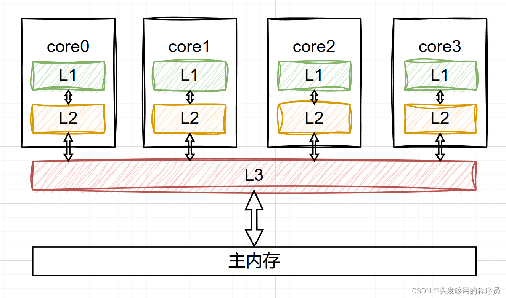

# Java 并发及多线程编程

## CPU 并发编程

### CPU 的可见性

CPU 高速缓存的模型

缓存一致性问题的出现

L1和 L2级别的缓存都是 CPU 私有的，L3缓存是各 CPU 核心共享的，这样就有数据不一致的问题：一个核修改了某数据，并更新了 L3，但是其他核会读取 L1和 L2的缓存，数据就不一致了。

> L1缓存会进行数据缓存和指令缓存的分类，L2整合这两个缓存，L3特点是各个核心共享

CPU 缓存行：数据在高速缓存中以缓存行为最小单位来存储的；主流的x86和 ARM架构缓存行是64字节。

CPU 解决数据一致性的方法：MESI 协议，并不是所有 CPU 都基于 MESI 去制作 CPU，但是主流 CPU 都支持 MESI 协议

- M，Modified
  - 当前核心独占缓存行，且数据已修改
  - 必须在该行被替换时写回主内存（Write Back）
- E, Exclusivq
  - 当前核心独占该缓存行，但数据与主内存一致
  - 可直接修改为 M 状态，无需通知其他核心
- S，Shared
  - 多个核心可能共享该缓存行，数据与主内存一致
  - 任何核心修改时需先广播失效请求（Invalidate）
- I，Invalid
  - 缓存行数据无效（未被缓存或已被其他核心修改）
  - 读取时必须从其他缓存或主内存重新加载

MESI协议的工作过程：

MESI 协议对不同的状态增加了不同的监听任务

- M 状态缓存行，监听其映射的主内存地址。如果有其他内核要读取这个数据，必须在之前先将缓存行写回主内存
- S 状态缓存行，必须监听该缓存行无效或者独占该缓存行的请求。如果监听到，将其状态转为 I
- I 状态缓存行，必须监听读取当前缓存行映射的主内存地址，如果监听到，将当前缓存行状态修改为 S。

示例场景：

- 初始加载：核心 A 读取数据 X，缓存行状态为 E（假设其他核心未缓存）。
- 共享读取：核心 B 读取 X，核心 A 和 B 的缓存行均变为 S。
- 独占修改：核心 A 修改 X：发送 Invalidate 使核心 B 的 X 失效（状态为 I）。 核心 A 的 X 变为 M。
- 写回内存：若核心 A 的 M 状态缓存行被替换，需执行 Write Back 到主内存。

> 既然 CPU 中有 MESI 协议来确保数据的一致性，为什么Java 还要 volatile？

CPU 优化层面对 MESI 的影响

> StoreBuffer，WriteBuffer是处理器内部的一个写缓存器，一些写操作不会执行到 L1上，而是先写 StoreBuffer，这样 CPU 效率更高。但是这样会影响 MESI 的工作过程。如修改了某数据到写缓冲器，但是没有到 L1，其他核心的状态应该变为 I，但是在写缓冲器同步到L1之前，就会短暂的数据不一致情况。
----
> 无效化队列（Invalidate Queue），处理 Invalidate 消息的。通过 Invalidate 消息入队列，提高处理速度。但是在队列中有等待调度时间，调度前也会有 Invalidate 消息未到达，导致数据不一致的问题。

CPU层面解决上述问题，使用 lock 指令；lock 指令期间的写操作，会立即写回主内存，CPU 的高速缓存也要写回去，必然会触发 MESI 协议，让其他缓存行状态同步。

### CPU的原子性

CPU 的一条指令必然是原子性的，但是高级语言的一行代码可能对应多个 CPU 的指令。
CPU 提供了指令 cmpxchg，也就是 CAS 操作。但是在多核情况下，如果没有保证多核之间的原子性，会导致 cmpxchg 操作，存在数据安全问题。
所以执行 cmpxchg 之前会使用 lock 指令，来保证多核 CPU 的原子性。

lock 指令类似 CPU 中的锁操作，有两种粒度

- 总线锁：阻塞 CPU 内核对主内存的读写操作
- 缓存锁：

### CPU的有序性

CPU会在一定规则下，对一些指令进行重新排序。
> as-if-serial：单线程
 在多核 CPU 的情况下，涉及到临界资源的修改，这种指令重排序会影响多线程运行结果的准确性。
----
> 内存屏障，Memory Barrier，是硬件层面提供的一些特殊指令，当 CPU 处理到这些指令时，会做一些特殊的处理，来规避重排序带来的问题。

x86提供了几种比较主要的内存屏障：

- lfence-加载屏障，用于读指令前，防止前后的CPU 指令重排序
- sfence-存储屏障
- mfence-全能屏障

lock->mfence->volatile

### JMM

Java Memory Model，是 java 语言层面上的内存模型抽象，屏蔽了底层硬件实现内存一致性需要的差异，提供了对上层的接口来保证内存一致性的编程能力。

Java 作为一个跨平台的语言，JMM 内存模型就是一个中间层模式。他适配不同的底层硬件系统，设计中间层模型来屏蔽细节。

- Java 利用汇编的 CAS+lock前缀指令来实现原子性(synchronized, ReentrantLock)
- Java 利用 lock 前缀指令+MESI 协议来实现可见性(volatile)
- Java 利用基于 lock 前缀指令的内存屏障来实现有序性(volatile)

## Java锁

synchronized 和 ReentrantLock 都是 java 提供的互斥锁。

- 加锁和释放锁
- wait&notify，await&signal

### Synchronized

特性

原理

锁优化

### Lock锁

ReentrantLock 是基于 AQS 的。Abstract Queue Synchronizer，有三个核心内容：

- state：获取锁的时候，将 state 基于 CAS 的方式，从0改为1，调用 unsafe 的 compareAndSet
- 同步队列（双向链表）：获取 ReentrantLock 锁资源，但是当前锁资源被其他线程持有了，当前线程进入队列排队
- 单向链表：持有锁的线程执行了 await 方法后，会将持有锁的线程封装为 Node，释放锁资源，进入队列，等待 signal 唤醒，唤醒后扔进同步队列

底层：

#### 加锁流程

以非公平锁的 lock 方法为例

#### 释放锁流程

#### await流程

#### signal流程

原理

## 参考

- 马士兵直播课
- 周志明《深入理解 Java 虚拟机》
- [lock 指令官方信息](https://www.felixcloutier.com/x86/lock)
