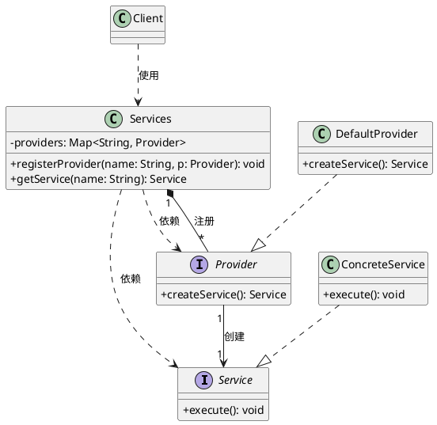

# Effective JAVA

## 

### 静态方法工厂 VS 构造器

构造器对开发者来说更加的熟悉，是一个特殊的方法，在类初始化阶段执行，用于给属性赋值；静态方法工厂是在某个类中，使用静态方法返回其一个对象实例或者其子类的对象实例，注意：静态方法工厂不等同于设计模式中的工厂方法。工厂方法更侧重于通过一个外部工厂来创建类型实例，而静态方法工厂，其类模式本身就是一个工厂。

优点：

1. 静态方法工厂拥有名称，而构造器没有名称，对于使用者来说，更加明确友好。

```java
public class BigInteger extends Number implements Comparable<BigInteger> {
    // 这是一个构造器方法
    public BigInteger(int bitLength, int certainty, Random rnd) {
        BigInteger prime;

        if (bitLength < 2)
            throw new ArithmeticException("bitLength < 2");
        prime = (bitLength < SMALL_PRIME_THRESHOLD
                                ? smallPrime(bitLength, certainty, rnd)
                                : largePrime(bitLength, certainty, rnd));
        signum = 1;
        mag = prime.mag;
    }
    // 这是一个静态工厂方法
    public static BigInteger probablePrime(int bitLength, Random rnd) {
        if (bitLength < 2)
            throw new ArithmeticException("bitLength < 2");

        return (bitLength < SMALL_PRIME_THRESHOLD ?
                smallPrime(bitLength, DEFAULT_PRIME_CERTAINTY, rnd) :
                largePrime(bitLength, DEFAULT_PRIME_CERTAINTY, rnd));
    }
}
```

理论上说，构造方法的重载特性对于用户来说是不太友好的，或许，使用静态工厂方法，并且在其内部自己使用私有的构造器方法是一个比较好的规范。

2. 静态工厂方法不必在每次调用的时候都创建一个新的对象

预先构建好要使用的对象，缓存起来，等到创建的时候直接返回，类似于享元模式。

```java
public final class Boolean implements java.io.Serializable,
                                      Comparable<Boolean>
{
    public static final Boolean TRUE = new Boolean(true);

    public static final Boolean FALSE = new Boolean(false);

    public static Boolean valueOf(boolean b) {
        return (b ? TRUE : FALSE);
    }
}
```

3. 可以返回该类型的子类对象，而不限于其类型自身

这个特性的使用是比较高级的，也融合了多个技巧。我们以Collections这个类来解析一下：

首先，因为Collection是一个接口，它在java8之前，不能有静态方法，所以，jdk设计一个Collections类用做Collection及其子类的静态工厂。<br></br>
其次，Collections中的静态方法返回的是所有的Collection的子类型，且强制要求客户使用接口来引用对象，这也是一个比较好的习惯。

4. 可以根据参数而返回不同的对象，这个不同指的是不同的子类型

```java
    public static <E extends Enum<E>> EnumSet<E> noneOf(Class<E> elementType) {
        Enum<?>[] universe = getUniverse(elementType);
        if (universe == null)
            throw new ClassCastException(elementType + " not an enum");

        if (universe.length <= 64)
            return new RegularEnumSet<>(elementType, universe);
        else
            return new JumboEnumSet<>(elementType, universe);
    }
```

5. 可以返回在编写该工厂时并不存在的类

这个灵活的特性构成了服务提供者框架(Service Provider Framework)，例如JDBC API。具体是：多个服务提供者实现一个服务，系统为服务提供者的客户端提供多个实现，并把它们从多个实现中解耦出来。



共有四个关键组件

- 服务接口，在JDBC中，就是Connection
- 提供者注册API，DriverManager.registerDriver
- 服务访问API，DriverManager.getConnection
- 服务提供者接口，Driver

Java6开始提供了一个通用的服务提供者框架java.util.ServiceLoader，JDBC不用它是因为JDBC出现的更早。
依赖注入框架可以认为是一个强大的服务提供者。

缺点

1. 类没有public 或者 protected 的构造方法，所以不能被子类化
2. javadoc不支持静态工厂API生成