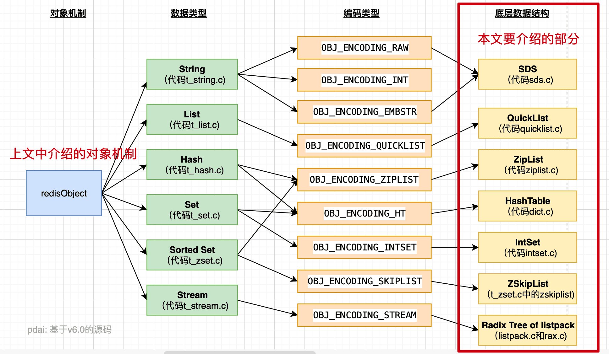

# Redis

## 命令详解

### 全局命令及慢查询日志

keys 查看所有键（支持通配符）：在生产中不适合用，keys 数量多，会有卡顿
dbsize：返回键的总数
exists：查看当前键是否存在
persist：将键的过期时间清除
type：返回键的数据结构类型
rename：
del：
expire：设置过期时间，时间单位秒
pexpire：添加过期时间，时间单位毫秒
pexpireat：添加过期时间，键在毫秒级时间戳 timestamp 后过期
ttl：查看键的过期时间

注意事项：

- keys 存在性能问题
- set 命令如果数据类型是 string，则会进行覆盖。TTL 时间只能对键设置，不能对二级数据结构做过期时间设置，如 hash 结构，zSet 结构。
- rename 命令

性能分析：

慢查询->慢查询日志

```bash
# 查看慢日志设置
config get slowlog-log-slower-than
# 1) "slowlog-log-slower-than" 
# 2) "10000" 默认时间单位是微秒
# 查看慢查询日志，结果是一个数组
slowlog get
#  将慢日志进行重置
slowlog reset 
# 将慢日志回写到日志
# 慢日志记录所有命令
config set slowlog-log-slower-than 0 
config rewrite
```

慢日志返回数组中数据结构解析

```text
1) 1) (integer) 3           # 慢查询条目的 id
   2) (integer) 1743738536  # 命令执行完成的时间戳
   3) (integer) 10          # 执行耗时，单位是 微秒
   4) 1) "get"              # 命令参数数组 
      2) "world"            
   5) "127.0.0.1:47750"     # 客户端连接信息
   6) ""                    # 通过CLIENT SETNAME设置的客户端名称
```

### string 结构命令

| command | desc |
| --- | --- |
| set ex px | 设置值 |
| setex |  设置时间|
| setnx | 不存在时设置，设置成功返回1，失败返回0|
| get | 不存在返回 nil |
| mset | 批量设置值 |
| mget | 批量获取值 |
|getset | 设置值并返回旧值 |
| incr|  自增1|
| incrby |  自增指定数字|
| decr|  自 减1|
| decrby |  自 减指定数字|
| append | 向字符串末尾追加值 |
| strlen|  返回字符串长度，每个中文占3个字节|

注意事项

- 如果 value 值不是数字，使用 incr等操作就会报错

性能分析

- 字符串操作时间复杂度：O(1)，Redis 的键值对是如何存储的？--全局哈希表（数组哈希桶，内部是一个 entry），redis 使用拉链法和 rehash 法来解决哈希冲突的问题

### hash结构命令

| command | desc |
| --- | --- |
| hset | 设置 |
| hsetnx | 设置 |
| hget | 取值 |
| hdel | 删除一个或多个 field，返回结果为成功删除 field 的个数 |
| hlen | 计算 field 个数 |
| hexists | 判断 field 是否存在 |
|hkeys | 获取所有 field|
|hvals|获取所有 values|
|hgetall | 获取所有field 与 value|

性能分析：

- 批量操作，hdel、hmset、hmget 跟 field 的值数量有关。hgetall 哈希的元素个数比较多，耗时也比较多；hscan
- 尽量少去用 hgetall 命令，避免 field 数量太多时，阻塞 redis

### list结构

| command | desc |
| --- | --- |
| lpush | |
| rpush | |
| linsert | |
| lpop| |
| rpop| |
| lrem| |
| ltrim| |
| lset| |
| lindex| |
| lrange| |
| llen| |
| blpop|  阻塞式从列表左侧弹出|
| brpop| 阻塞式从列表右侧弹出，没有元素就会阻塞，也支持设定阻塞时间，单位秒 |

- list 可以用来实现双端队列，栈等结构，因为阻塞式命令的存在，也可以做阻塞队列

### set结构

| command | desc |
| --- | --- |
| sadd | |
| srem| |
| scard| 计算元素个数 |
| sismember|  |
| srandmember| |
| spop| |
| smembers| |
| sinter| 求交集 |
| suinon| 求多个集合的并集 |
| sdiff| 求多个集合的 差集|
| sinterstore| 求多个集合的交集，结果存放到另一个键 |
| suionstore| 求多个集合的并集 |
| sdiffstore| 求多个集合的差集 |

- set 可用于集合求并求交的场景

### zset结构

| command | desc |
| --- | --- |
| zadd |  添加一个带分数的元素 |
| |  |
| |  |
| |  |
| |  |
| |  |
| |  |

## Redis底层数据结构



### SDS

simple dynamic string 结构，SDS 是 Redis 基本数据结构 Strng 的默认底层实现。

SDS 的内部结构

sdshdr（头部）+ buf[]（它的最后一位是'/0'）

头部的内部结构：

- len（占 sdshdr 后面的数字个位的 uint 类型），表示数组中使用的字符串长度
- alloc，同上，uint 类型，代表数组中剩余的位置长度
- flags，低3位表示 type，高5位没有用到
- buf[]，存储数据的数组

SDS 的一些特性

字符串底层都是动态数组，那为什么不直接使用 C 语言提供的字符串类型呢？即 SDS 相对于原生的字符串提供了什么特性？

- sdshdr 头部中有 len 属性，获取字符串长度 O(1)，但是 C 中的字符串获取长度需要遍历至"/0"，时间 O(n)
- 字符串拼接防溢出，SDS 会先根据拼接字符串中的 len 属性来判断内存是否足够分配
- 空间预分配，扩容时，会比实际需要多扩充一些容量，来避免多次的扩容操作
- 惰性空间释放，当字符串缩短时，并不会马上释放内存，而是先记录在 len 和 alloc 中，如果后续再扩容，还可以继续使用，从而避免了内存释放再分配的操作
- C 字符串使用空字符串作为末尾的判断，而二进制中可能含有空字符串，造成误判；SDS 使用长度来作为字符串结束的判断
- SDS 兼容了 C 字符串以空字符串结尾的特性

### QuickList

基本数据结构 List 的底层是使用了 QuickList 的数据结构

### ZipList

Hash 和 zSet 中的底层使用了 ZipList，通过表头的字段可以快速定位到左右边界元素

数组结构详情：

"\<zlbytes\>\<zltail>\<zllen>\<entry>\<entry>\<entry>...\<entry>\<zlend>"

- zlbytes：uint32_t，存储整个 ziplist 占用的内在的字节数
- zltail：uint32_t，

### 跳表 zSkipList

## 高级数据类型与底层实现

### bitmap 使用场景

相关命令

| command | desc |
| --- | --- |
| setbit key offset value | |
|getbit key offset | 获取指定偏移量上的位的值 |
| bitcount key [start end] | 统计指定范围内的中值为1的个数 |
| bitop operation destkey key [key...] | 对一个或多个 bitmap 进行位操作，并进行运算，包括 and、or、xor、 ｜

使用场景

统计一下100万用户，连续10天的签到的情况。
每天的日期->key->每个 key 对应一个100万（二进制位） 的 bitmap，每个 bit 对应一个用户的当前签到的情况（1认为是签到，0就是没有）
bitcount 统计 bitmap1的天数。连续10天的用户总数使用 and 计算

### 布隆过滤器

### HyperLogLog 场景

### GEO使用场景与底层原理

## 参考资料

- 马士兵直播课：李瑾《Redis 数据类型及底层实现》
