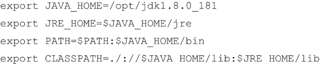

# linux

## 磁盘系统

以下是一个30G磁盘的机器的容量分配。

注意到在linux文件系统中，有以下几种概念。

- 物理卷PV：指物理磁盘或者分区，如系统盘和数据盘
- 卷组VG：由一个或多个PV组成，可以通过添加PV实现扩容
- 逻辑卷LV：从VG中划分出的逻辑分区，可以分别挂载不同的目录。一个卷组中可以分多个挂载，一般只有数据盘才需要挂载到系统中的目录。支持动态的调整大小。

建议的分配：

- 首先区分物理分区，用来存放OS的分区有500M-1G就够用了，这部分后续就不再使用了。
- 接下来是数据盘，其中又有三项：
  - / 根挂载，这部分一般20G容量就够用了
  - /home，多余的容量可以分配在这里
  - SWAP，在内存不够使用时，借助这个区域来缓存，一般5G就够用了。


## linux命令收集

```bash
# ：查看系统内核及硬件信息
uname -a
# ：查看系统发行版信息
cat /etc/issue
```



```text
export JAVA_HOME=/opt/jdk1.8
export JRE_HOME=$JAVA_HOME/jre
export PATH=$PATH:$JAVA_HOME/bin
export CLASSPATH=./://$JAVA_HOME/lib:$JRE_HOME/lib
```

## ubuntu20安装python3

在 Ubuntu 20.04 上安装 Python 并配置中国镜像源的完整步骤如下：

### 一、安装 Python（以 Python 3.8 为例）
```bash
# 更新软件包列表
sudo apt update

# 安装 Python 3 和 pip
sudo apt install -y python3 python3-pip

# 检查版本
python3 --version
pip3 --version
```

### 二、配置中国镜像源（pip加速）
#### 方法1：临时使用镜像源
```bash
pip3 install 包名 -i https://pypi.tuna.tsinghua.edu.cn/simple
```

#### 方法2：永久修改配置
```bash
# 创建 pip 配置目录
mkdir -p ~/.pip

# 编辑配置文件（使用清华源）
cat > ~/.pip/pip.conf <<EOF
[global]
index-url = https://pypi.tuna.tsinghua.edu.cn/simple
trusted-host = pypi.tuna.tsinghua.edu.cn
EOF
```

### 三、可选：安装 Python 3.8（如果系统自带版本过低）
```bash
# 添加 deadsnakes PPA
sudo add-apt-repository ppa:deadsnakes/ppa
sudo apt update

# 安装 Python 3.8
sudo apt install -y python3.8

# 设置 Python 3.8 为默认版本
sudo update-alternatives --install /usr/bin/python3 python3 /usr/bin/python3.8 1
sudo update-alternatives --config python3  # 交互式选择版本
```

### 四、验证配置
```bash
# 检查镜像源是否生效
pip3 config list

# 测试安装（例如安装requests）
pip3 install requests
```

### 常用中国镜像源地址
| 镜像名称       | URL                                      |
|----------------|-----------------------------------------|
| 清华大学       | https://pypi.tuna.tsinghua.edu.cn/simple |
| 阿里云         | https://mirrors.aliyun.com/pypi/simple   |
| 中国科技大学   | https://pypi.mirrors.ustc.edu.cn/simple  |
| 豆瓣           | https://pypi.doubanio.com/simple         |

### 注意事项
1. 操作需管理员权限时记得加 `sudo`
2. 如果遇到 SSL 错误，可添加 `--trusted-host` 参数
3. 企业内网可能需要额外配置代理

如果需要安装其他 Python 版本（如 3.9/3.10），只需修改版本号重复步骤即可。