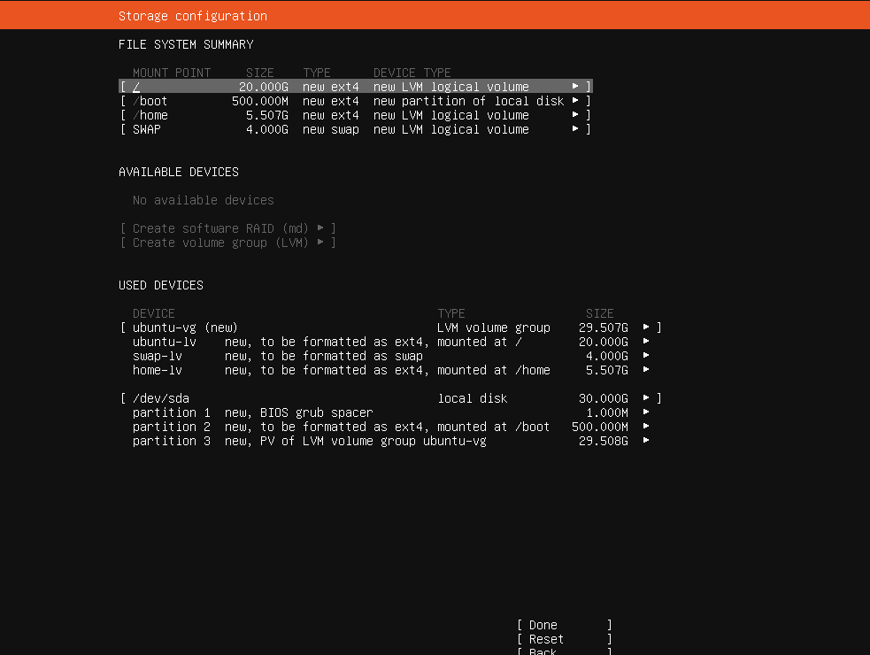

# linux

## 磁盘系统

以下是一个30G磁盘的机器的容量分配。

注意到在linux文件系统中，有以下几种概念。

- 物理卷PV：指物理磁盘或者分区，如系统盘和数据盘
- 卷组VG：由一个或多个PV组成，可以通过添加PV实现扩容
- 逻辑卷LV：从VG中划分出的逻辑分区，可以分别挂载不同的目录。一个卷组中可以分多个挂载，一般只有数据盘才需要挂载到系统中的目录。支持动态的调整大小。

建议的分配：

- 首先区分物理分区，用来存放OS的分区有500M-1G就够用了，这部分后续就不再使用了。
- 接下来是数据盘，其中又有三项：
  - / 根挂载，这部分一般20G容量就够用了
  - /home，多余的容量可以分配在这里
  - SWAP，在内存不够使用时，借助这个区域来缓存，一般5G就够用了。

