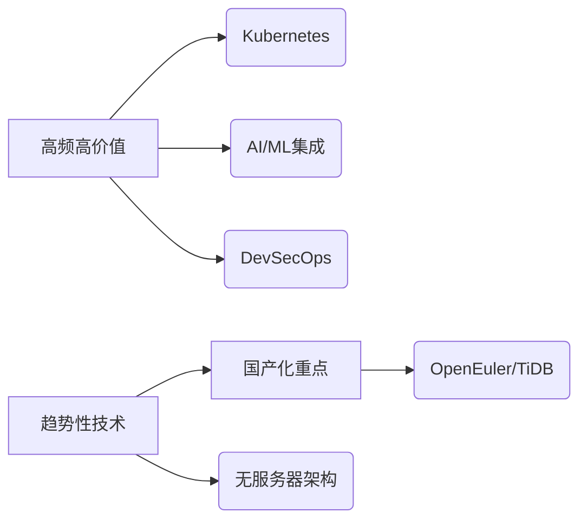

基于当前后端技术热点（云原生、AI融合、微服务、安全及国产化生态），以下是为期**6个月的系统性学习计划**，分阶段聚焦核心技能，结合实战与理论：

---

### **📅 学习计划总览**

| **阶段** | **时长** | **核心目标** | **技术重点** |
|----------|----------|--------------|--------------|
| **基础巩固** | 第1-2月 | 掌握云原生与容器化基石 | Docker/K8s + 微服务架构 |
| **AI融合开发** | 第3-4月 | 后端与AI集成实战 | Python+MLOps + 智能运维 |
| **高阶与国产化** | 第5-6月 | 安全架构与国产生态 | DevSecOps + 仓颉语言实践 |

---

### **🔧 分阶段学习路径**

#### **阶段1：云原生与微服务（第1-2月）**

- **核心学习**:
  - **Docker**：镜像构建、网络配置（[官方文档](https://docs.docker.com/)）。
  - **Kubernetes**：Pod/Service部署、Helm包管理（[K8s实践教程](https://kubernetes.io/docs/tutorials/kubernetes-basics/)）。
  - **微服务架构**：Spring Cloud/Alibaba（服务注册、熔断）。
- **实战项目**：  
  > ✅ *部署一个电商微服务系统（商品/订单/支付服务），用K8s管理扩缩容。*

#### **阶段2：AI与后端融合（第3-4月）**

- **核心学习**:
  - **Python数据分析**：Pandas/Scikit-learn处理业务数据。
  - **AI模型部署**：FastAPI部署推荐模型 + Prometheus监控。
  - **智能运维**：ELK日志分析 + AI异常检测（如PyOD）。
- **实战项目**：  
  > ✅ *构建用户行为分析系统：用Flask收集日志，训练聚类模型（K-Means）实现异常访问预警。*

#### **阶段3：安全与国产化（第5-6月）**

- **核心学习**:
  - **DevSecOps**：SonarQube代码扫描 + OWASP ZAP渗透测试。
  - **华为仓颉语言**：语法学习（待7月开源后跟进[官网](https://www.huawei.com)）。
  - **国产替代方案**：TiDB（分布式数据库） + OpenEuler OS。
- **实战项目**：  
  > ✅ *开发安全API网关：用仓颉语言实现JWT鉴权 + 审计日志，部署于OpenEuler。*

---

### **⚡ 高效学习策略**

1. **每日投入**：2小时（理论1h + 编码1h），周末4小时项目实战。  
2. **资源推荐**：
   - 云原生：[《Kubernetes in Action》](https://www.manning.com/books/kubernetes-in-action)
   - AI集成：[《Building Machine Learning Powered Applications》](https://www.oreilly.com/library/view/building-machine-learning/9781492045106/)
   - 安全：[DevSecOps实践指南（GitHub开源案例库）](https://github.com/DevSecOps)
3. **社区联动**：
   - 参与**K8s SIG小组**、**华为开发者论坛**（跟踪仓颉语言动态）。
   - 用**GitHub记录代码**，接受Code Review。

---

### **💡 关键产出与验收**

| **时间点** | **里程碑** | **验证方式** |
|------------|------------|--------------|
| 第2月末 | 微服务+K8s项目上线 | GitHub仓库 + 博客部署文档 |
| 第4月末 | AI运维系统运行报告 | 模型准确率≥85% + 监控仪表盘截图 |
| 第6月末 | 国产化安全项目Demo | 仓颉代码库 + 渗透测试结果 |

> **提示**：根据华为仓颉语言开源进度（7月30日）动态调整阶段3计划，优先掌握其**AgentDSL框架**与**全并发GC机制**设计思想。

---

### **🌐 技术栈优先级矩阵**

此计划紧密贴合市场**“云原生+AI+安全”** 三角需求，兼顾效率与国产化浪潮。**立即行动**：[点击此处生成你的学习日程表模板](https://coda.io/templates/Study_Planner)。
