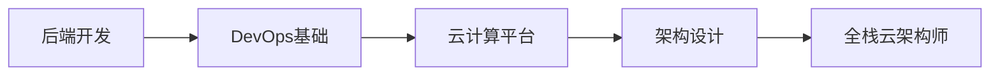

# sap

作为后端开发工程师，转型为 **DevOps工程师/云计算架构师** 是一个高价值的职业路径。以下是结合你的技术背景设计的 **系统性成长指南**，涵盖技能进阶、学习路径和实战建议。

---

### **一、核心转型路线图**



#### **阶段目标**：
1. **补齐DevOps工具链** → 2. **掌握云平台核心服务** → 3. **设计可扩展的云架构** → 4. **实现自动化与优化**

---

### **二、分阶段学习路径**
#### **阶段1：DevOps基础（1-3个月）**
**目标**：掌握CI/CD、自动化运维、监控等核心技能  
**关键技能**：
| **领域**       | **学习内容**                                                                 |
|----------------|-----------------------------------------------------------------------------|
| **版本控制**   | Git高级用法（分支策略、Hooks）                                              |
| **CI/CD**      | Jenkins/GitLab CI/CD Pipeline编写，ArgoCD（GitOps）                         |
| **容器化**     | Docker（镜像优化、多阶段构建），Kubernetes（Pod/Deployment/Service）        |
| **IaC**        | Terraform（AWS/Aliyun Provider），Ansible（配置管理）                       |
| **监控日志**   | Prometheus + Grafana，ELK/EFK日志体系                                       |

**实战项目**：  
- 用Jenkins构建Java/Python应用的自动化测试+部署流水线  
- 使用Terraform在AWS/Aliyun上自动创建ECS集群  

---

#### **阶段2：云计算平台深度（3-6个月）**
**目标**：掌握至少一个主流云平台的架构设计能力  
**推荐认证**（选1-2个）：  
- **AWS**: DevOps Engineer + Solutions Architect  
- **阿里云**: DevOps工程师认证 + ACP架构师  
- **Azure**: AZ-400 + AZ-305  

**重点云服务**：
| **分类**       | AWS服务示例                  | 阿里云服务示例              |
|----------------|-----------------------------|---------------------------|
| **计算**       | EC2, Lambda, ECS/EKS        | ECS, Serverless, ACK      |
| **网络**       | VPC, ALB, Route53           | VPC, SLB, Alibaba DNS     |
| **存储**       | S3, EBS, EFS               | OSS, NAS, Disk           |
| **安全**       | IAM, KMS, WAF              | RAM, KMS, WAF            |
| **数据库**     | RDS, DynamoDB, Aurora       | RDS, PolarDB, MongoDB    |

**实战项目**：  
- 在AWS/Aliyun上部署高可用Web应用（前端+后端+数据库）  
- 设计无服务器数据处理流水线（API Gateway → Lambda → DynamoDB）  

---

#### **阶段3：云架构设计（6-12个月）**
**目标**：掌握企业级云架构设计原则与优化  
**核心能力**：  
1. **高可用设计**  
   - 多可用区部署 + Auto Scaling  
   - 灾难恢复方案（RTO/RPO评估）  
2. **成本优化**  
   - 预留实例 vs. Spot实例计算  
   - 存储分层（S3 Intelligent-Tiering/OSS低频访问）  
3. **安全合规**  
   - 网络隔离（VPC Peering/PrivateLink）  
   - 合规框架（等保2.0/GDPR）  

**学习资源**：  
- 书籍：*《云原生架构设计》*（阿里云MVP编写）  
- 案例研究：AWS/Aliyun官方架构中心（如AWS Well-Architected）  

---

### **三、关键软技能提升**
1. **跨团队协作**：  
   - 理解研发/测试/运维的痛点（如你的后端经验是优势）  
2. **自动化思维**：  
   - 一切手动操作都要思考“如何用代码实现”  
3. **成本敏感度**：  
   - 学会用TCO（总拥有成本）评估架构方案  

---

### **四、求职与转型策略**
#### **1. 简历优化方向**

```diff
+ 突出“云+自动化”经验：
  - “使用Terraform管理200+台EC2实例，成本降低30%”
  - “设计K8s Helm Chart实现微服务一键部署”
```

#### **2. 目标岗位**
- **初级转型**：DevOps工程师 → 云运维工程师  
- **中级目标**：云架构师 → SRE（站点可靠性工程师）  
- **高阶方向**：云解决方案架构师（需结合行业经验）  

#### **3. 面试准备重点**
- **技术问题**：  
  - “如何设计一个千万级用户的容灾架构？”  
  - “CI/CD流水线中如何实现安全扫描？”  
- **行为问题**：  
  - “举例说明你解决的跨部门协作问题”  

---

### **五、推荐学习资源**
#### **1. 在线课程**
- **DevOps**：  
  - [Udemy: DevOps Masterclass](https://www.udemy.com/course/devopsmasterclass/)（含K8s实战）  
- **云计算**：  
  - [A Cloud Guru: AWS/Azure全路径](https://acloudguru.com/)  

#### **2. 实验平台**
- **Katacoda**（免费K8s交互式实验）  
- **阿里云沙箱实验室**（中文友好）  

#### **3. 社区**
- **CNCF基金会**（参与开源项目如Prometheus）  
- **极客时间专栏**（《DevOps实战笔记》）  

---

### **六、避坑指南**
1. **不要盲目考认证**：先动手做项目，再考认证背书。  
2. **避免“工具集邮”**：精通一套工具链（如AWS+Terraform）比泛泛而学更重要。  
3. **保持编码习惯**：DevOps需要持续写脚本（Python/Go）。  

---

通过这个路径，你可以逐步从 **“会写代码的后端工程师”** 成长为 **“懂架构的云原生专家”**。下一步建议：  
1. 选择一个云平台（推荐AWS/阿里云）开始实践  
2. 在本职工作中寻找自动化改进机会（如优化部署流程）  

如果需要更具体的资源推荐（如书籍/实验手册），可以告诉我你的当前技术栈（如Java/Python）！ 🚀