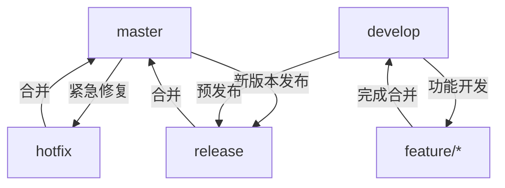
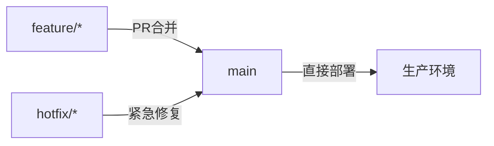

# Git 分支策略全面解析

在团队协作开发中，合理使用 Git 分支策略是项目成功的关键。下面介绍主流的分支策略模型及最佳实践：

## 🚦 主流分支策略模型

### 1. **Git Flow**（经典模型）



• 核心分支：

  • `master` - 生产版本（永远可部署）

  • `develop` - 集成开发分支

• 支持分支：

  • `feature/*` - 新功能开发

  • `release/*` - 版本预发布

  • `hotfix/*` - 线上紧急修复

• 适用场景：版本迭代明确的传统项目（如客户端软件）


---

### 2. **GitHub Flow**（简化模型）


• 核心原则：

  • 仅保留 `main` 分支为常青分支

  • 所有新功能通过 Pull Request 合并

  • 合并即部署

• 特点：

  • 分支类型：`feature-*` + `hotfix-*`

  • 持续部署：每天多次发布

• 适用场景：Web应用/SaaS服务（如Rails应用）


---

### 3. **GitLab Flow**（环境分支模型）


• 核心分支：

  • `main` - 开发主干

  • `staging` - 测试环境

  • `production` - 生产环境

• 工作流：

  ```bash
  # 1. 创建功能分支
  git checkout -b feat/new-api main
  
  # 2. 开发完成后发起MR
  git push origin feat/new-api
  
  # 3. 合并到main分支
  git checkout main
  git merge --no-ff feat/new-api
  
  # 4. 升级环境分支
  git checkout staging
  git merge main
  ```
• 适用场景：需要多环境验证的企业应用


---

### 4. **Trunk Based Development**（主干开发）


• 核心特点：

  • 所有开发者直接提交到主干（`main/trunk`）

  • 短期分支生存期 < 1天

  • 通过 Feature Flags 控制未完成功能

• 技术支撑：

  • 代码提交原子化

  • 强制的CI/CD流水线

• 适用场景：大型团队高频交付（如Google/Facebook）


---

## 🔑 分支命名规范

| 分支类型       | 命名模式                | 示例                     |
|----------------|------------------------|--------------------------|
| 功能开发       | `feat/<功能简述>`      | `feat/user-auth`         |
| 缺陷修复       | `fix/<问题描述>`       | `fix/login-error`        |
| 紧急热修复     | `hotfix/<问题描述>`    | `hotfix/payment-fail`    |
| 发布分支       | `release/<版本号>`     | `release/v2.3.0`         |
| 文档更新       | `docs/<文档主题>`      | `docs/api-reference`     |

---

## ⚠️ 分支管理禁区

1. 禁止直接提交到受保护分支
   ```bash
   # 错误做法
   git commit -m "紧急修改" --force
   
   # 正确做法
   git checkout -b hotfix/issue123
   git push origin hotfix/issue123
   ```

2. 避免长期存在的分支
   > 分支存活超过3天会产生 80%+ 的合并冲突概率

3. 禁用巨型合并
   ```bash
   # 不良实践（产生冲突地狱）
   git merge feature-monolith
   
   # 推荐方案
   git merge --squash feature-module1
   ```

---

## 🛠️ 高效分支工具链

| 工具类别       | 推荐工具                      | 作用                     |
|----------------|-----------------------------|--------------------------|
| 分支可视化     | `git log --graph --oneline` | 图形化显示分支演进       |
| 冲突解决       | VS Code / Vim diff3         | 三方合并工具             |
| 分支清理       | `git branch --merged \| grep -v "main" \| xargs git branch -d` | 自动删除已合并分支       |
| 分支保护       | GitHub Protected Branches   | 阻止强制推送             |
| PR自动化       | Danger.js                   | 自动检查PR规范           |

---

## ✅ 分支策略选择指南

| 项目类型         | 推荐策略           | 关键要点                      |
|------------------|-------------------|------------------------------|
| 移动应用         | Git Flow         | 明确版本发布周期              |
| 微服务架构       | Trunk-Based      | 服务独立开发快速迭代          |
| 企业级系统       | GitLab Flow      | 严格环境验证流程              |
| 开源库维护       | GitHub Flow      | 简化协作模型                  |

> 📌 黄金准则：选择适合团队协作节奏的策略，而非盲目追随大厂方案。小型团队可从简化版GitHub Flow开始，随着复杂度提升演进到GitLab Flow。

掌握科学的分支策略可使团队协作效率提升300%+，同时将合并冲突减少90%。立即评估您的项目需求，选择最适合的分支工作流！