# navicat

> navicat是一个windows下，一个好用的数据库连接客户端，它是收费的。所以自己实验用需要破解。

## 下载

下载从百度云的软件中寻找。解压后目录如下

```text
rsa私钥：           用于破解时认证
navicat16安装包：   用于安装navicat软件
navicat-cracker：   破解的工具
```

## 激活方法

方式一：永久激活
    
1. 激活前先断网！！！激活前先断网！！！激活前先断网！！！

2. 解压缩文件夹，进入 “永久激活” 文件夹，右击 NavicatCracker.exe，以管理员方式运行。

3. 按步骤进行，先选择 navicat16 的安装路径，然后检查路径是否正确，再点击 “Patch”。
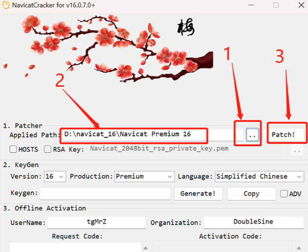

4. 在弹出的窗口中，点击 “是(Y)”。
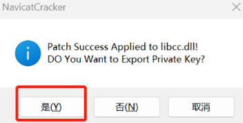

5. 先点击 “Generate!”，然后 “Copy” 生成的 Keygen
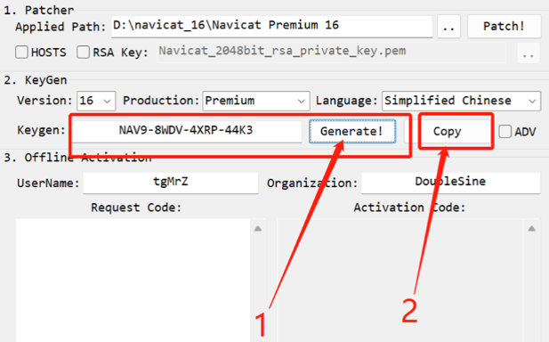

6. 这个时候打开 navicat16 软件（桌面上有快捷方式），点击 “注册”。
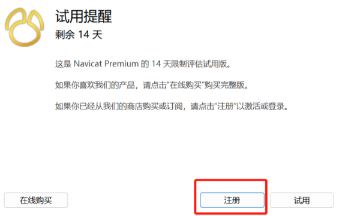

7. 将刚刚复制的 Keygen 粘贴在 1 处，然后点击 “激活”。
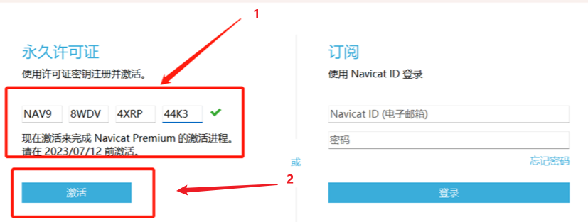

8. 在弹出的窗口中，点击 “手动激活”。
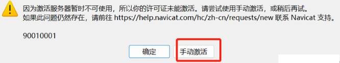

9. 在弹出的窗口中，复制请求码（如下图红框内容）。
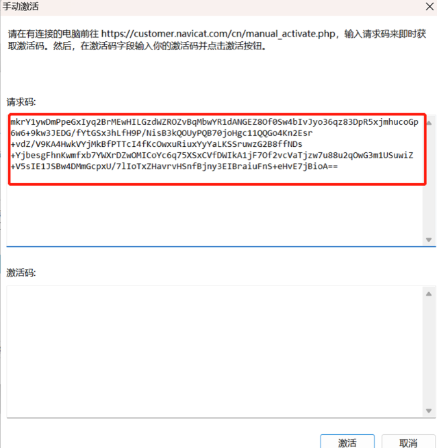

10. 这时回到激活工具处，将刚刚复制的请求码复制到 1 处，然后点击 2 处 “Generate Activation Code”，此时在 3 处会生成一串字符，复制 3 处的字符串。
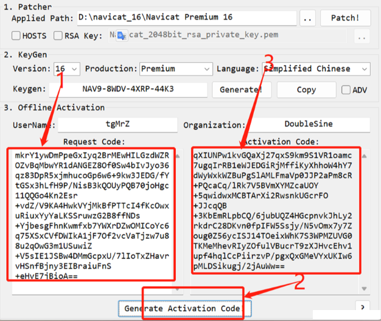

11. 将刚刚复制的字符串粘贴到 “激活码” 下面，然后点击 “激活”。
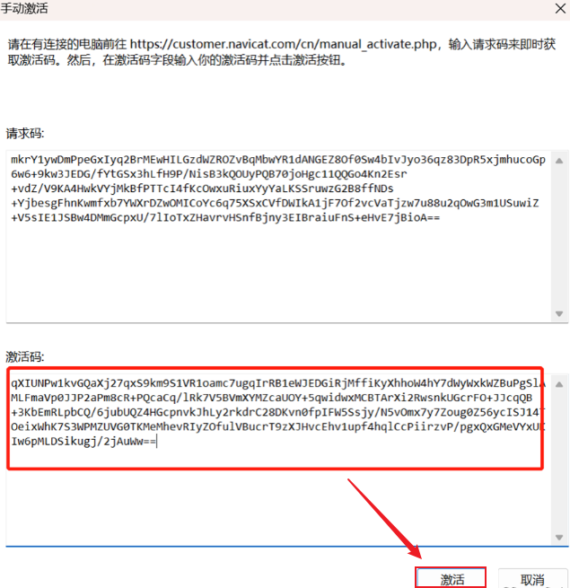

12. 激活成功，点击 “确定”。
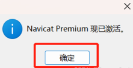

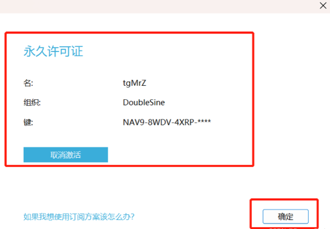

可能出现的问题：
问题 1：永久激活工具点击 “Path” 时出现下图：

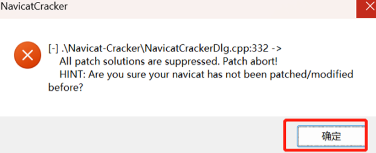

原因：未断网。

解决办法：卸载 navicate16，重新安装后断网激活。

问题2：navicat-cracker被windows自动删除。需要关闭 windows安全中心->病毒与威胁防护->实时保护

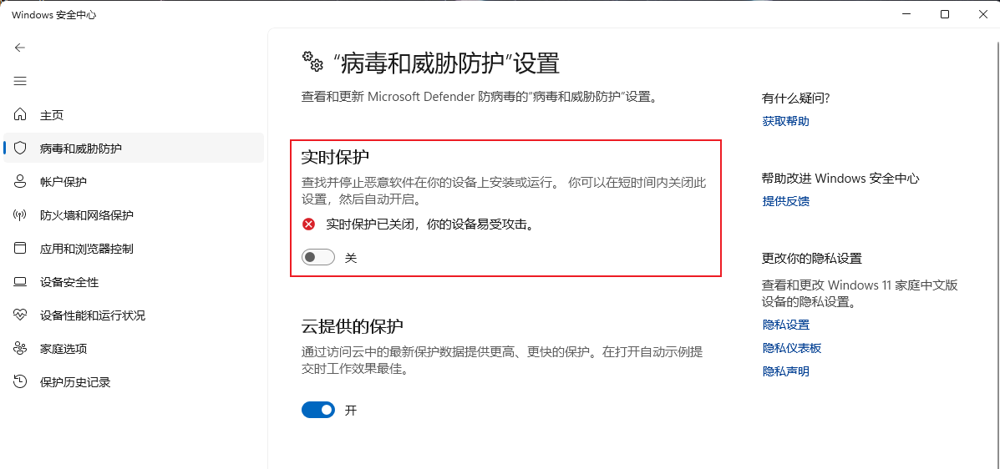