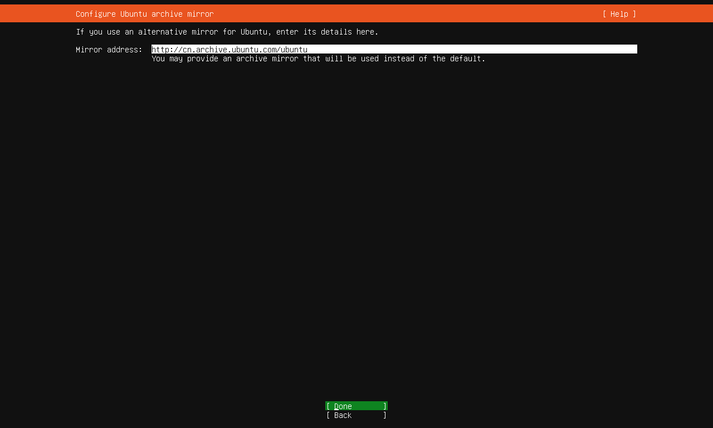
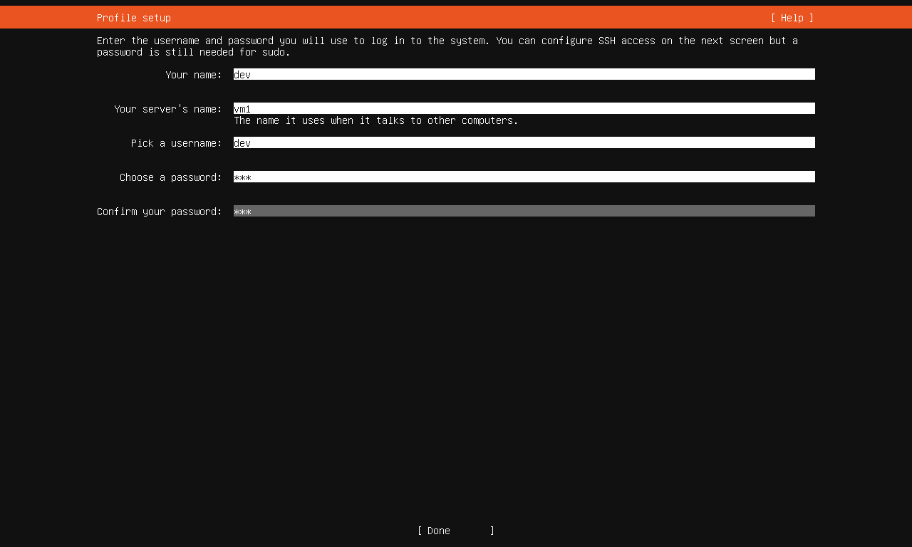

# vm虚拟机

## windows下使用vmware创建管理虚拟机

下载vmware工作站和os镜像

> 可以在百度云中寻找

### 创建步骤

1. 配置ubuntu存档的镜像,可以在这里配置,也可以进入到OS中再配置


> 阿里云镜像 (https://mirrors.aliyun.com/ubuntu/) \
> 清华大学镜像 (https://mirrors.tuna.tsinghua.edu.cn/ubuntu/) \
> 中科大镜像 (https://mirrors.ustc.edu.cn/ubuntu/) \
> 华为云镜像 (https://repo.huaweicloud.com/ubuntu/) \
> 网易镜像 (http://mirrors.163.com/ubuntu/)         

2. 创建服务器用户,这里使用`dev/dev`


### 镜像复制

### OS环境

安装必要的系统包和依赖

#### 0. 检查系统信息

```bash
top
htop
free -h
df -h
```

#### 1. 系统更新与基础工具

```bash
sudo apt update && sudo apt upgrade -y  # 更新系统软件包
sudo apt install -y build-essential    # 包含 GCC/G++/Make 等编译工具
sudo apt install -y software-properties-common  # 提供 add-apt-repository 命令
sudo apt install -y apt-transport-https ca-certificates curl wget gnupg lsb-release  # 常用下载/证书工具
```

#### 2. 常用工具包

```bash
sudo apt install -y git                # 版本控制工具
sudo apt install -y vim                # 文本编辑器
sudo apt install -y htop net-tools     # 系统监控和网络工具
sudo apt install -y zip unzip tar      # 压缩/解压工具
sudo apt install -y tree               # 目录树显示工具
sudo apt install -y tmux               # 终端复用工具
```

#### 4. 网络与安全

```bash
sudo apt install -y ufw                # 防火墙管理工具
sudo ufw enable                       # 启用防火墙（默认拒绝所有入站）
sudo apt install -y fail2ban           # 防暴力破解工具
```

#### 5. 可选依赖（根据需求安装）

Python 开发:

```bash
sudo apt install -y python3-dev python3-pip python3-venv
```

数据库客户端:

```bash
sudo apt install -y postgresql-client mysql-client sqlite3
```

多媒体支持:

```bash
sudo apt install -y ffmpeg libjpeg-dev libpng-dev
```

Docker 支持:

```bash
curl -fsSL https://download.docker.com/linux/ubuntu/gpg | sudo gpg --dearmor -o /usr/share/keyrings/docker-archive-keyring.gpg
echo "deb [arch=amd64 signed-by=/usr/share/keyrings/docker-archive-keyring.gpg] https://download.docker.com/linux/ubuntu $(lsb_release -cs) stable" | sudo tee /etc/apt/sources.list.d/docker.list > /dev/null
sudo apt update && sudo apt install -y docker-ce docker-ce-cli containerd.io
```

#### 6. 清理缓存

```bash
sudo apt autoremove -y   # 删除无用包
sudo apt clean           # 清理下载缓存
```

