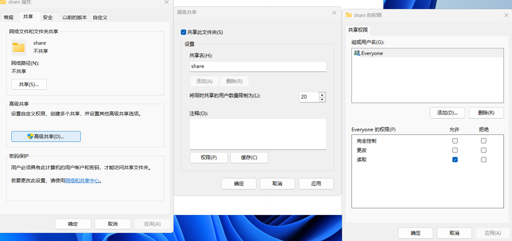
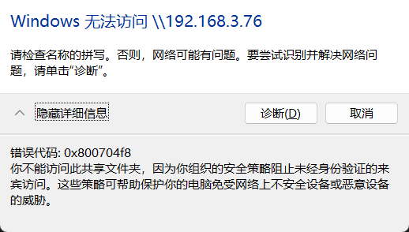
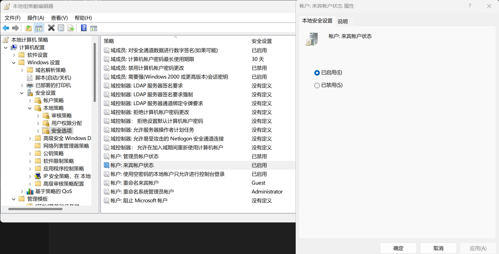
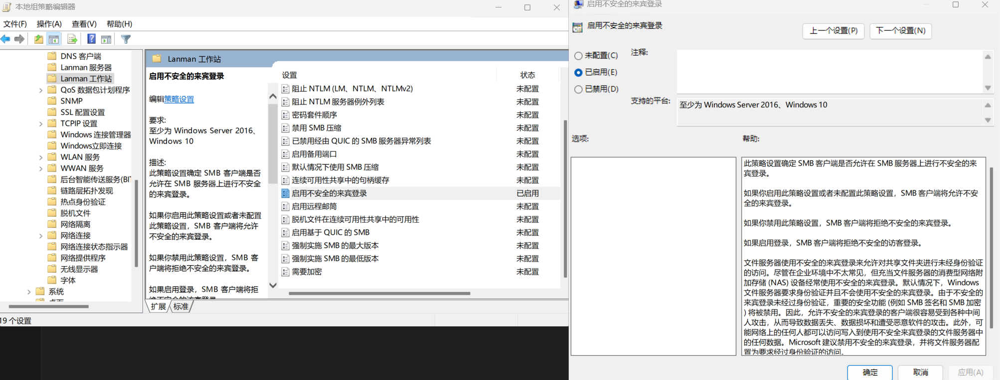

# windows工具

## 局域网windows系统下传输文件

局域网根据传输两端的系统不同，传输方式不同：

- unix-unix: scp
- unix-windows: scp或者WinSCP
- windows-windows: 共享文件夹

共享文件夹的具体方式

1. 启用网络发现和文件共享（两台电脑均需设置）：

打开 控制面板 > 网络和 Internet > 网络和共享中心 > 高级共享设置。

确保以下选项已启用：

- 启用网络发现
- 启用文件和打印机共享
- 关闭密码保护共享（若无需密码验证）。

<!--  -->

2. 设置共享文件夹：

右键点击需要共享的文件夹 → 属性 → 共享 → 高级共享。         \
勾选 共享此文件夹，设置权限（如允许“Everyone”读取/写入）。

<!--  -->

3. 访问共享文件夹：

在另一台电脑上，打开 文件资源管理器，地址栏输入：

`\\目标电脑的IP地址`
例如：

`\\192.168.1.100`

输入目标电脑的用户名和密码（若启用了密码保护）。

### 报错解决

错误如图
<!--  -->

解决方法：

1. 使用快捷键win+R打开运行，打开“gpedit.msc”
2. 计算机配置 > Windows设置 > 安全设置 > 本地策略 > 安全选项 > “账号：来宾账户状态” > “已启用”
3. 计算机配置 > 管理模板> 网络 > Lanman工作站 > “启用不安全的来宾登录” > “已启用”

<!--  -->

<!--  -->
